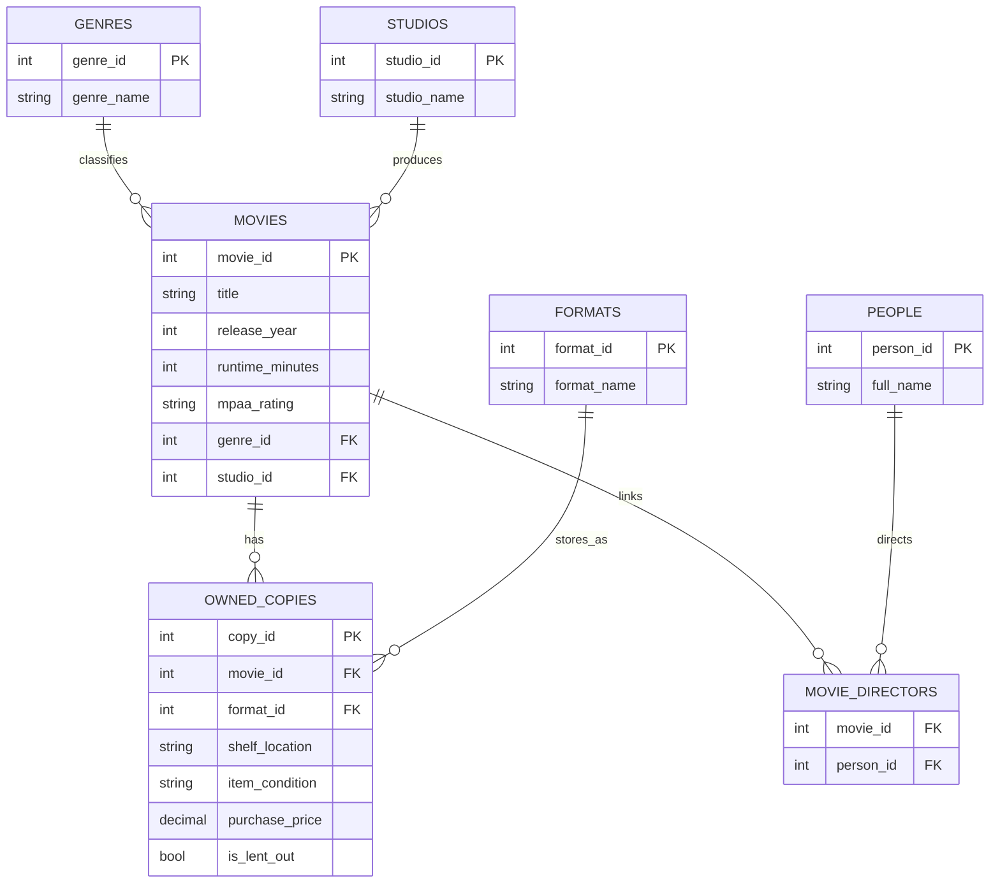

# Entity Relationship Diagram

## Integrity Rules

- Primary keys uniquely identify each row.
- Foreign keys enforce valid relationships between tables.
- Check constraints restrict invalid values such as impossible release years or unsupported ratings.
- Unique constraints reduce duplicate movie and copy records.
